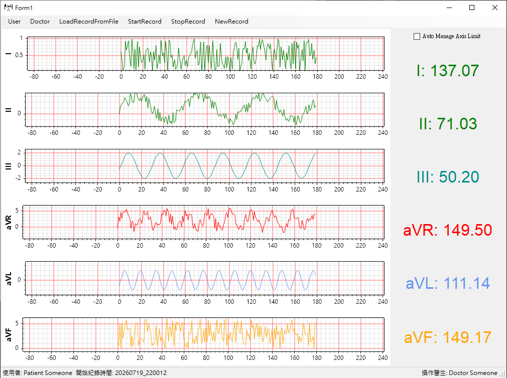
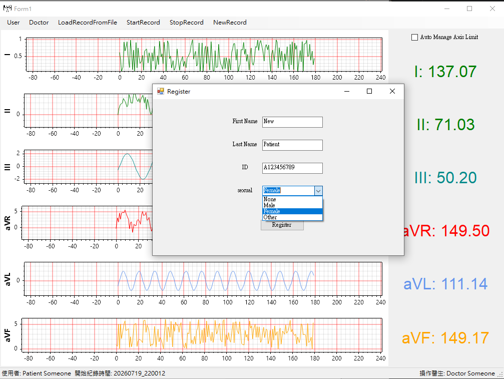
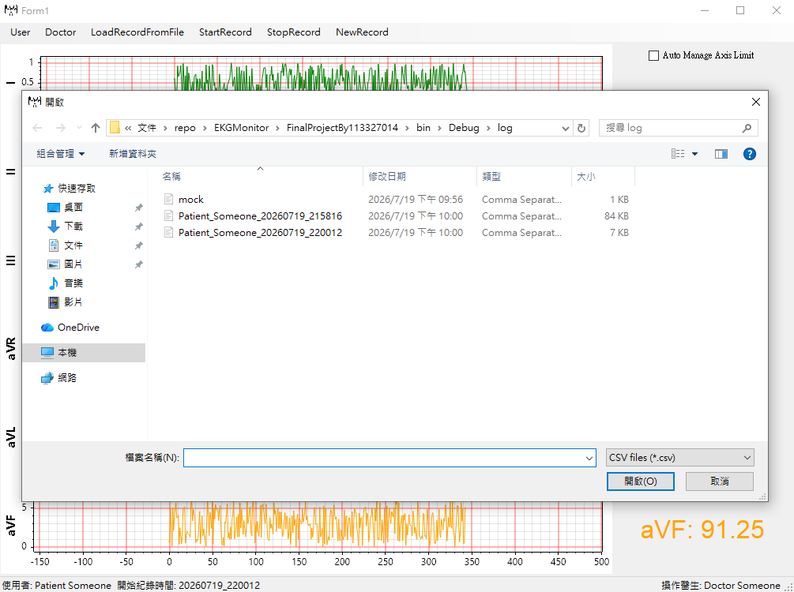

# EKG Monitor

A data acquisition and persistence pipeline with a pluggable signal source, plus a WinForms UI.

C# / WinForms / .NET Framework 4.7.2, ~4,100 lines. Archived coursework from a graduate
Object-Oriented Programming class. The code is preserved as it was written; this repository
adds only a `.gitignore` and documentation.

## What it does

Six signal generators are sampled on a 10 ms timer. Each sample set is written into
per-lead in-memory queues, and once the buffer reaches a threshold, a background task
drains it to CSV. People and their records are persisted separately as JSON.

Two things worth stating up front:

- The topic and its requirements (six leads, role separation, record management) were set
  by the course. Driving the pipeline from synthetic signals is part of that specification,
  not a shortcut taken during implementation.
- **There is no signal analysis in this project.** The "physiological data" shown on screen
  is random numbers, unrelated to the waveform. See `ENGINEERING_NOTES.md`, issue (a).

So what this code demonstrates is data flow and lifecycle handling, not biosignal processing.

## Screens



Main view. Each lead is driven by its own generator, so all three synthetic types are visible
at once: III and aVL are clean sine waves, II is sine plus noise, and I, aVR and aVF are pure
noise. The six figures on the right are the "physiological data" described above; they are
random and unrelated to the traces beside them.
The status bar carries the selected patient, the operating doctor, and the recording start
timestamp used to name the CSV.

|  |  |
|:---:|:---:|
| Registration dialog, one generic form reused for both roles | Loading a stored session; recorded CSVs are named per patient and start time |

## Architecture

| Layer | Types |
|---|---|
| Shell | `Form1`, the entry point from `Program.cs`; hosts `PortableEKGMonitor` docked to fill |
| Signal | `SignalBase` and four subclasses; `SignalFactory` |
| Record | `EKGRecord : RecordBase, IDisposable` |
| Domain | `PersonBase`, `User`, `Doctor`, `MedicalDataContainer` |
| Serialization | Newtonsoft.Json with a custom `DoctorJsonConverter` |
| UI | `PortableEKGMonitor` (UserControl), generic dialogs `PersonRegisterForm<T>` / `SelectPersonForm<T>` |

```
Windows.Forms.Timer (10 ms, UI thread)
  -> SignalBase.Next() x6
  -> EKGRecord.AddData()      lock(_dataLock), enqueue
  -> at threshold: Task.Run -> lock(_fileLock) -> lock(_dataLock) snapshot
                            -> release data lock -> write CSV
```

`RealSignal` accepts an injected `delegate double SignalProvider(double currentTime)`
as a seam for a real acquisition source. That seam is **not currently used**: nothing in
the codebase constructs a `RealSignal`. The system runs without hardware because all six
leads are driven by synthetic generators, not because of this injection point.

## Concurrency model

Single producer: `AddData` has exactly one call site, driven by a `System.Windows.Forms.Timer`,
so production stays on the UI thread. Sample writes happen on the thread pool.
`SaveBufferedDataToFileAsync` takes `_fileLock` first, then holds `_dataLock` only long enough
to swap the queues out, and performs file I/O after releasing the data lock.

Details, and five known defects in this design, are in
[`ENGINEERING_NOTES.md`](ENGINEERING_NOTES.md).

## Building

Requires Windows and Visual Studio 2022. Dependencies use the legacy packages.config format,
and `packages/` is not tracked, so restore before opening the solution:

```
nuget restore FinalProjectBy113327014.sln
```

`dotnet restore` and `msbuild -t:restore` will not work here: those serve PackageReference.
The csproj imports four `.targets` files from under `packages/` and fails to load if they
are absent.

Key dependencies: ScottPlot 5.0.55 (plotting), SkiaSharp 3.119.0, Newtonsoft.Json 13.0.3.

**Build status:** builds and runs on Windows. The screenshots above were taken from a live
session, including a recording written to CSV and reloaded from disk.

## Scope

All code is my own work. Plotting is handled by ScottPlot, a third-party library, and is not
my work; the same applies to the other NuGet dependencies (SkiaSharp, HarfBuzzSharp,
Newtonsoft.Json, OpenTK).

Project and assembly names are kept as originally submitted.

This is an archived portfolio artifact, not intended for reuse.
